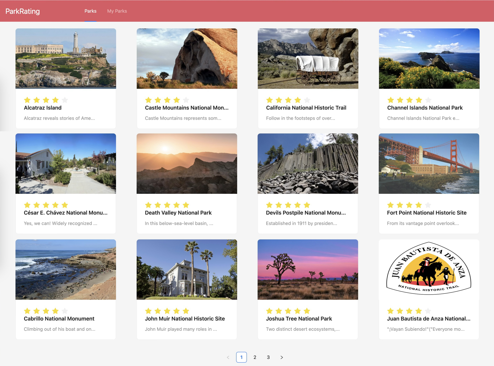
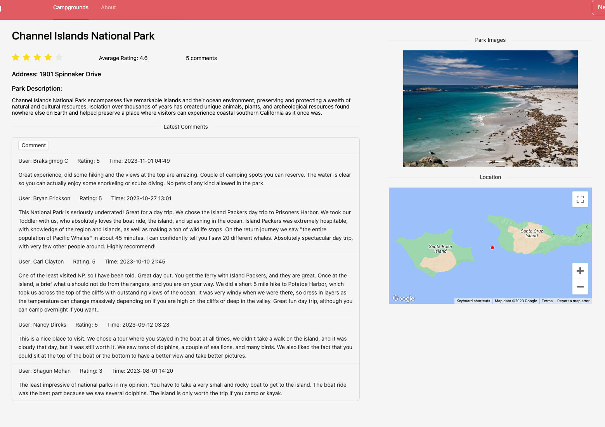

## Project set up
#### web
- install [nodejs](https://nodejs.org/en/download)
- create a react app: `npx create-react-app web`<br>
Main js code are in `src` folder and `index.js` is the project entry file. Dependencies are in `node_modules` folder recorded in package.json.
- activate front-end:<br>
`cd web/`<br>
`pnpm start` or `npm start`
#### server
- ` pip install Django`
- create a django server: `django-admin startproject server`. 
- Create a application in the project : `python3 manage.py startapp {name}`, name is `app` for this project. 
- start the server: <br>
`cd server/`<br>
`python3 manage.py runserver localhost:8081`
#### database
- enter the folder with docker-compose.yml and start dockers `docker-compse up -d`
- mongodb: `docker-compose exec mongodb bash` or `docker-compose exec mongodb mongosh`
- redis: `docker-compose exec redis redis-cli`. we can use `keys *` to check what was stored in redis DB, but this is not recommended when the db is large.
#### .env
To use the Google Map feature, we need to have an API key. create your `.env` like `.env.example` and set the key values.
## Main points
1. System Architecture:
- Caching with Redis: We implemented Redis as our caching system to enhance performance for frequently accessed data. When our system receives a request, it first checks the Redis cache. If the requested data is found there, it is returned immediately. However, if the data is not in the Redis cache, our system will then search for it in the MongoDB database.
- Database with MongoDB: MongoDB serves as our primary database, ideal for storing complex information about national parks in America.
  - The main collection is called ca_np with all kinds of detailed information of National Parks in CA.
  - There are other collections such as comments, newsreleases, thingstodo and images to store more data. We used hash (md5) to avoid duplicates in image collection because images are large files and we do not want to waste space on that.
- APIs for Detailed Searches: Developed RESTful APIs to enable detailed searches of park information.<br></br>
    <p float="left">
      
       
    </p>
2. Web UI Design:
- Built Using Django: We designed a simple web UI with Django to display park information.
- Home Page Overview: The home page (first image) provides a brief view of each park.
- Detailed Park Information: Upon clicking on a specific park (second image), detailed information is displayed including location on Google Maps, park rating, description, images, and the most updated user comments.

## Play with APIs
### Via Postman
- `localhost:8081/api/add_park`: we can add a park in the list and provide some details. Set to POST model and set Body to raw - JSON on Postman. Send the park information in JSON format. "id", "fullName", "description", "state" and "rating" are required and the others are opotinal. Below is an example.
  ```
  {
      "id": "5595FE50-F218-4439-8D2E-F47449835547", 
      "fullName": "Arches National Park", 
      "description": "Arches National Park, renowned for its breathtaking red rock formations and over 2,000 natural stone arches, offers a unique and mesmerizing landscape sculpted by nature in southeastern Utah",
      "state": "UT", 
      "images": [{"url":"https://www.nps.gov/npgallery/GetAsset/3d547795-34cf-4604-9a42-a11c1bcbe534/proxy/hires?"}],
      "longitude":"-109.54",
      "latitude":"38.728056",
      "rating":"4.6",
      "comments":0
  }
  ```
- `localhost:8081/api/upload_image`: We can upload images to the database, which is designed to avoid duplicates. Set the method to POST and Body to form-data in Postman. Select the Key as 'file' and set the key name to 'image', then upload the image in the Value field. If you upload the same image twice, there will be no difference, but the server terminal will display a message saying 'image exists.' This indicates that the second image is identical to the first one, and we will only store one copy.
### On the web app
- `get_park_list` powers the home page by listing all the parks. Every time the user accesses the page, it retrieves data from either Redis or MongoDB, depending on the Redis expiration time and whether a new park has been added.
- `get_park_detail`, `search_visitcenter`, `search_park_news` and other APIs support the detail page. Their working mechanism is similar to park_list.
- Users can add a comment by clicking the "comment" button, which is facilitated by the `add_comment` API. After entering their comments and the information shown below, users can click the OK button, and the information will be added to this park. The most recent comment will be displayed at the top of the comment section, and the system will recalculate and update the average rating and total number of comments in MongoDB. Once you refresh the page, the updated rating and comment count will be displayed. <br>Note that this API will delete the previous cache for this park since the information has changed. Therefore, the next time the information is accessed, it will be retrieved from MongoDB, and the most updated information will be added to the cache as well.
  

## Other information
UI component package: Ant Design (we used components like Layout, Button, Rate, Input textbox, Card, List, Typography, etc.)<br>
`pnpm install axios` is a Promise based HTTP client for the browser and node.js


